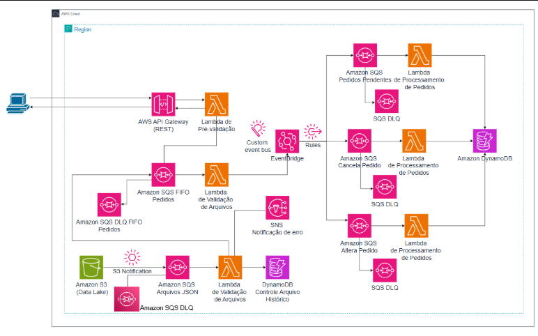
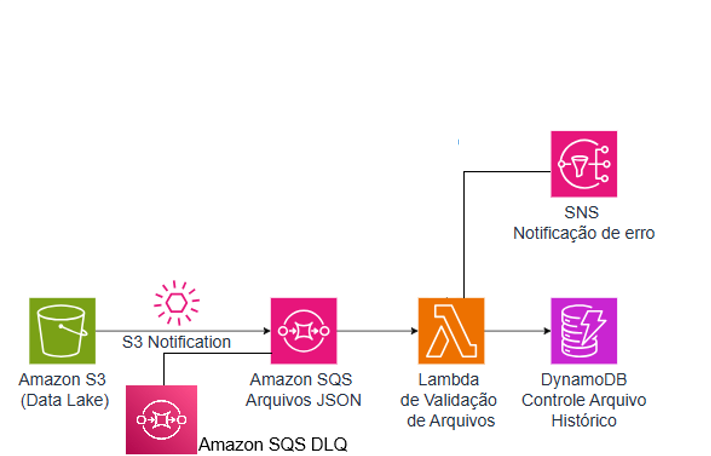

# Semana do Desenvolvedor EDN

Esta pasta reúne os laboratórios da **Semana do Desenvolvedor AWS** da **Escola da Nuvem**, organizados dentro do repositório central [Hands_On_AWS_Dev](../). A proposta da semana foi construir, na prática, uma **arquitetura orientada a eventos** para processamento de pedidos e arquivos na AWS.

## O que é a Semana do Desenvolvedor AWS

Trata-se de um evento intensivo com:

- **4 dias focados 100% na prática**
- Conteúdo voltado para alunos do curso **AWS Developer Associate**
- Uma proposta de construir um fluxo completo usando serviços AWS integrados

A promessa da semana foi clara: desenvolver uma arquitetura capaz de **receber, validar, processar e encaminhar pedidos e arquivos** com desacoplamento, resiliência e escalabilidade.

## O desafio da semana

O projeto parte de um problema bem comum em sistemas modernos:

- Uma empresa precisa gerenciar pedidos de forma eficiente e escalável
- esses pedidos podem chegar em **tempo real via API**
- ou em **lotes de arquivos via Amazon S3**

Para resolver isso, a semana foi estruturada em torno de uma arquitetura orientada a eventos, preparada para:

- Receber dados de múltiplas fontes
- Validar e processar pedidos
- Desacoplar etapas com filas
- Publicar eventos para novos consumidores
- Permitir evolução gradual do fluxo de negócio

## A arquitetura que vamos construir

Ao longo dos 4 dias, a trilha monta um sistema com estas características centrais:

- **Arquitetura orientada a eventos** como base do processamento
- **Recebe, valida e processa** pedidos de múltiplas fontes
- **Desacoplamento, resiliência e escalabilidade** com serviços AWS integrados

No fim da semana, a arquitetura combina:

- Entrada via **API REST**
- Ingestão de arquivos via **Amazon S3**
- Processamento assíncrono com **Amazon SQS**
- Validações e regras de negócio com **AWS Lambda**
- Roteamento e barramento de eventos com **Amazon EventBridge**
- Notificações com **Amazon SNS**
- Persistência e rastreabilidade com **Amazon DynamoDB**

### Arquitetura completa da semana

## Interface web da trilha

Além desta documentação em Markdown, a trilha agora também possui uma interface frontend em:

- [Abrir frontend da Semana do Desenvolvedor EDN](https://ferfaoliver-ferreira.github.io/Hands_On_AWS_Dev/)

Se o link ainda não abrir imediatamente, aguarde a publicação do GitHub Pages terminar após o próximo push no repositório.

Nela, você encontra:

- página inicial com visão geral da semana
- navegação separada para os quatro dias
- destaque visual das arquiteturas de cada etapa
- acesso rápido aos READMEs originais e ao repositório central

## Resultado esperado ao final da semana

Ao concluir a trilha, a ideia é ter uma arquitetura completa com:

- **Ingestão múltipla**
  API REST para pedidos em tempo real e S3 para processamento em lote
- **Processamento assíncrono**
  SQS para desacoplamento e EventBridge como barramento de eventos
- **Pipeline de validação**
  Lambdas especializadas para cada etapa do fluxo
- **Rastreabilidade**
  acompanhamento do estado dos pedidos e dos arquivos processados

## Estrutura da semana

| Dia | Pasta | Tema principal | Foco técnico |
| :--- | :--- | :--- | :--- |
| Dia 1 | [dia-1-api-eventbridge](./dia-1-api-eventbridge) | Ingestão de pedidos via API e EventBridge | API Gateway, AWS Lambda, Amazon SQS FIFO, DLQ e Amazon EventBridge |
| Dia 2 | [dia-2-s3-integracao](./dia-2-s3-integracao) | Ingestão de arquivos via S3 e rastreamento | Amazon S3, Amazon SQS Standard, AWS Lambda, Amazon DynamoDB e Amazon SNS |
| Dia 3 | [dia-3-processamento-pedidos](./dia-3-processamento-pedidos) | Processamento central de pedidos e persistência | Amazon EventBridge, Amazon SQS, AWS Lambda e Amazon DynamoDB |
| Dia 4 | [dia-4-fluxos-dlq](./dia-4-fluxos-dlq) | Fluxos adicionais de pedidos e DLQs | Regras de negócio, EventBridge, AWS Lambda, Amazon SQS e dead-letter queues |

## Principais funcionalidades por dia

### Dia 1

O primeiro laboratório constroi a base de entrada em tempo real:

- **API Gateway**
  endpoint funcional para receber pedidos
- **AWS Lambda**
  duas funções Lambda para validação
- **Amazon SQS**
  uma fila SQS FIFO para desacoplar o processamento
- **Amazon EventBridge**
  um barramento de eventos customizado para notificar sobre novos pedidos validados

### Dia 2

O segundo laboratório adiciona a entrada por arquivos:

- **Amazon S3**
  bucket configurado para receber arquivos JSON de pedidos
- **Amazon SQS**
  duas filas SQS Standard para desacoplar o processamento inicial dos arquivos
- **AWS Lambda**
  função para extrair pedidos e enviar para o pipeline principal
- **Amazon DynamoDB**
  tabela destinada ao histórico de validação de arquivos
- **Amazon SNS**
  tópico para notificações de erro na validação de arquivos

### Dia 3

O terceiro dia concentra o processamento principal do pedido:

- **Amazon EventBridge**
  roteamento de eventos de novos pedidos validados
- **AWS Lambda**
  execução da lógica central de processamento do pedido
- **Amazon SQS**
  desacoplamento do processamento principal
- **Amazon DynamoDB**
  armazenamento do estado e dos detalhes dos pedidos processados

### Dia 4

O quarto dia amplia os fluxos de negócio e reforça o tratamento de falhas:

- **Fluxos funcionais**
  cancelamento e alteração de pedidos
- **Amazon EventBridge**
  novas regras para roteamento dos eventos
- **AWS Lambda**
  duas novas funções Lambda para validação
- **Amazon SQS**
  aprofundamento prático no funcionamento e na importância das DLQs

## Nosso roteiro diario

Esta trilha foi organizada da seguinte forma:

1. **Dia 1**
   Ingestão de pedidos via API e EventBridge
2. **Dia 2**
   Ingestão de arquivos via S3 e rastreamento
3. **Dia 3**
   Processamento central de pedidos e persistência
4. **Dia 4**
   Fluxos adicionais de pedidos e DLQs

## Como está pasta está organizada

Cada subpasta desta trilha representa um dia da semana e deve conter:

- `README.md` com o contexto e o passo a passo do laboratório
- pasta `images/` com as evidências visuais
- arquitetura da etapa
- serviços utilizados
- seções de validação e limpeza dos recursos
